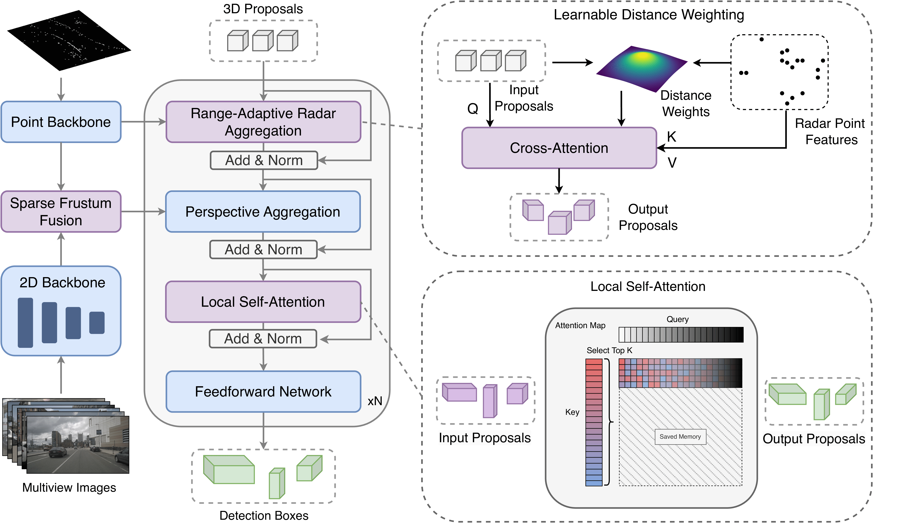

# ✨ SpaRC ✨
**SpaRC: Sparse Radar-Camera Fusion for 3D Object Detection**

Philipp Wolters, Johannes Gilg, Torben Teepe, Fabian Herzog, Felix Fent, Gerhard Rigoll

[](https://arxiv.org/abs/2411.19860)
[](https://phi-wol.github.io/sparc)
[](https://paperswithcode.com/sota/3d-object-detection-on-truckscenes?p=sparc-sparse-radar-camera-fusion-for-3d)
[](https://paperswithcode.com/sota/3d-object-detection-on-nuscenes-camera-radar?p=sparc-sparse-radar-camera-fusion-for-3d)


## Introduction

This repository is an official implementation of [SpaRC](https://phi-wol.github.io/sparc), our novel sparse fusion transformer for 3D perception that integrates multi-view image semantics with radar point features. 

<p align="center">

</p>


## News
- `[2024/4/17]` Official PyTorch implementation is coming soon.
- `[2024/11/29]` Our preprint is available on [arXiv](https://arxiv.org/abs/2411.19860).

## Getting Started

## Model Zoo

## Citation
If this work is helpful for your research or applications, please consider giving us a star 🌟 and citing it by the following BibTeX entry.
```bibtex
@article{wolters2024sparc,
  title={SpaRC: Sparse Radar-Camera Fusion for 3D Object Detection},
  author={Wolters, Philipp and Gilg, Johannes and Teepe, Torben and Herzog, Fabian and Fent, Felix and Rigoll, Gerhard},
  journal={arXiv preprint arXiv:2411.19860},
  year={2024}
}
```